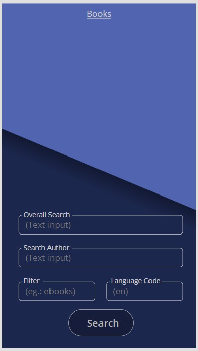
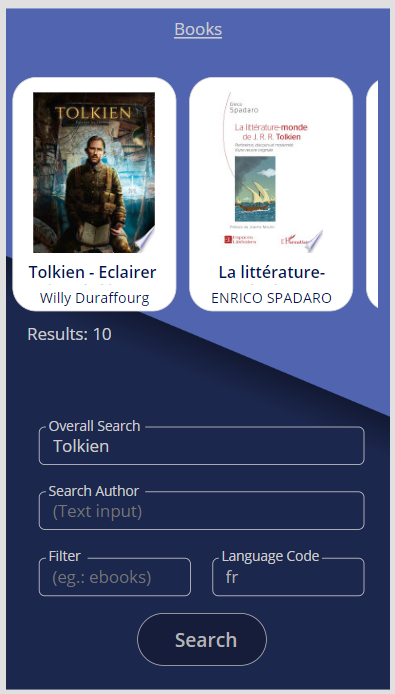
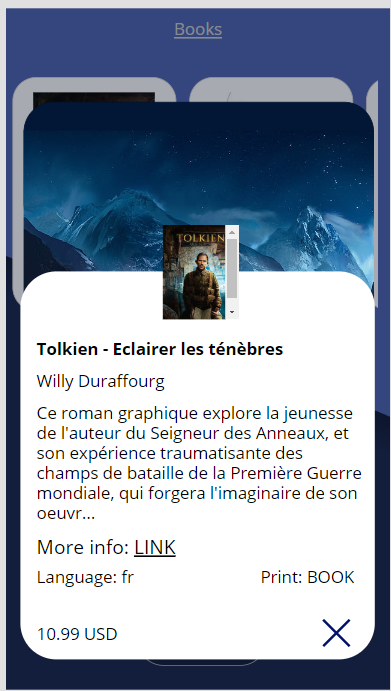

# Demo - Google Books

A quick prototype showcasing the basic use case scenario of the Google Books independent publisher connector.

# Table of Content

- [Demo - Google Books](#demo---google-books)
- [Table of Content](#table-of-content)
- [Features](#features)
  - [Search UI](#search-ui)
  - [Results UI](#results-ui)
  - [Details UI](#details-ui)

# Features

- Search the Google Books database
- Inspect first 10 results
- Verify details of a result in popup

## Search UI

## Results UI

## Details UI

