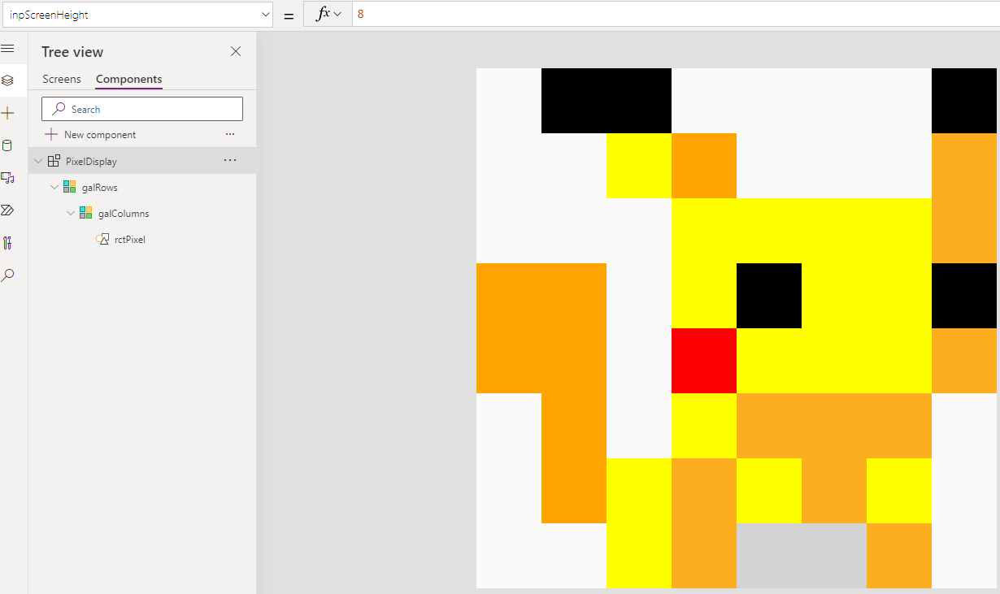
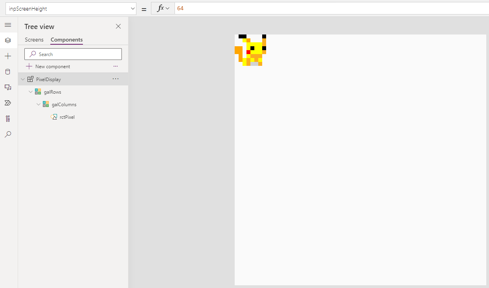

# Pixel Display

A versatile reusable, resizable, responsive canvas component to show pixels on the screen based on input configuration.

# Table of Content

- [Pixel Display](#pixel-display)
- [Table of Content](#table-of-content)
- [Details](#details)

# Details 

**Inputs**
- *Data*: a 2 dimensional array defining the pixel pattern to display
- *Pixel Padding*: padding to show between pixels. Can be set to 0, meaning no padding included
- *Screen Color*: the background color of the screen behind the pixels. By default is set to Green (#00ab41)
- *Screen Height*: the amount of pixels expected to be shown in Y dimension of the screen component
- *Screen Width*: the amount of pixels expected to be shown in X dimension of the screen component

The component is **responsive**, meaning it recalculates the pixel sizes based on the actual (current) size of the component and the selected dimensions (X and Y).

The screen is **RGB colored**, meaning in input data it is possible to define for each pixel what color to show with a related hex string. Supports alpha channel too.

The screen is **passive**, meaning there is no action performed when any of the pixels are selected (pushed or clicked).

Additionally, check example of changing dimensions from 8x8 to 64x64 pixels without amending the input data itself:

