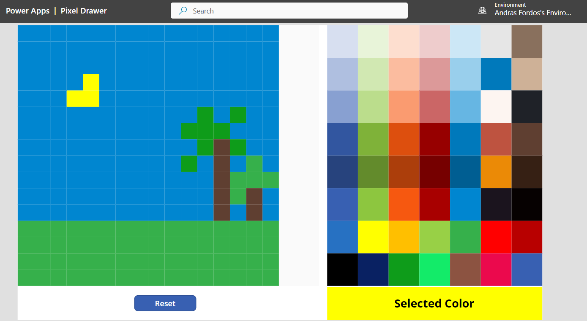

# Pixel Drawer

A versatile reusable, resizable, responsive canvas component to draw pixels on the screen and make it available to export in a manual manner.

# Table of Content

- [Pixel Drawer](#pixel-drawer)
- [Table of Content](#table-of-content)
- [Details](#details)
- [Limitations](#limitations)
- [Example](#example)

# Details 

**Inputs**
- *Pixel Padding*: padding to show between pixels. Can be set to 0, meaning no padding included
- *Screen Color*: the background color of the screen behind the pixels. By default is set to Green (#00ab41)
- *Screen Height*: the amount of pixels expected to be shown in Y dimension of the screen component
- *Screen Width*: the amount of pixels expected to be shown in X dimension of the screen component
- *Paint Color*: the color used to draw on selected pixels
- *Debug*: boolean, when enabled, writes the HEX code of pixels on them in front of screen

The component is **responsive**, meaning it recalculates the pixel sizes based on the actual (current) size of the component and the selected dimensions (X and Y).

The screen is **RGB colored**, meaning in input data it is possible to define for each pixel what color to show with a related hex string. Supports alpha channel too.

The screen is **passive**, meaning there is no action performed when any of the pixels are selected (pushed or clicked).

# Limitations

A "Reset" event has to be triggered on the component before first use

# Example

